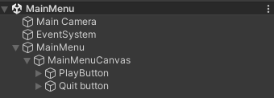
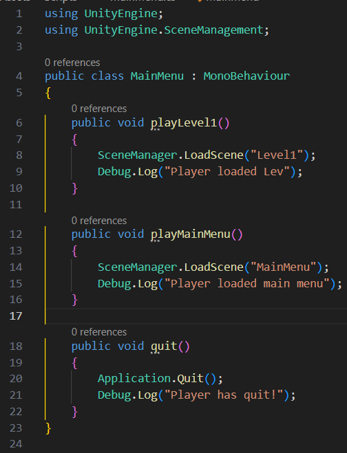
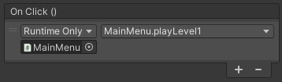

# How to make a main menu.
Today we are going to learn how to make a simple main menu that will take you to your next scene and quit your game.

The version I will be using for this is 2022.3.46f1.

The first thing we need to do is to make an empty game object, this will be where we hold everything that we need to make our menu and as such we will name this MainMenu.

We then need to make a new canvas which is a child of the empty game object, we will name this MainMenuCanvas.

 Once that is done, we then need to create two buttons, we want to use the TextMeshPro variant and not the legacy version as this version will be removed in the future. The first button will be named PlayButton, and the second button will be named QuitButton. These will function as your Play and Quit buttons.

Once you have your two buttons under your menu canvas  it should then look something like this.

Once you have that all done you then need to make a new c# script. This script will hold the functions for changing to the next scene as well as quitting the application.

Here is the code that we will be using for this.

you need to add the "using UnityEngine.SceneManagement" after the "using UnityEngine" line. Once that is done you will then go into your MainMenu class and then make three methods. The first one is to Play the game, which will be used by our Playbutton, the second will be to take you back to the main menu from your game scene and the third one will make the application close.

The Debug.log("") lines will output the message you put in the brackets to the console, you do not need them for the script but it is helpful to have so you know which scene you are loaded into from just the console.

We then need to add this script to our MainMenu empty game object which will then allow us to add the code to the buttons we have made. Since they are public methods, they can be seen by unity and therefore available for the On Click () function for our buttons.

Once you are on the PlayButton, in the inspector scroll down until you see the On Click () function. You then need to click the + icon to add a new function and then you need to drag your MainMenu game object into the drop down under where it says, "Runtime Only". Once that is done you can then go and select a function, you want to go to MainMenu and then you will see your playLevel1, playMainMenu and quit methods there. To make the QuitButton you would do the same thing but choose quit as the function.

You should now have something like this for it.

Now all you must do is move your buttons do your desired location and you now have a main menu that can take you the next scene of your game and quit your game.

If you want to be able to test each of them then in your Level1 scene you can copy over the MainMenu game object and then change the playButton to use the playMainMenu method instead of the Level1 method.

With that you are all set for your main menu, you can load up your first level and have a way to go back to the main menu while also having a way to quit the game in a remarkably uncomplicated way.

Thank you for using this tutorial and I hope you have a great rest of your day.